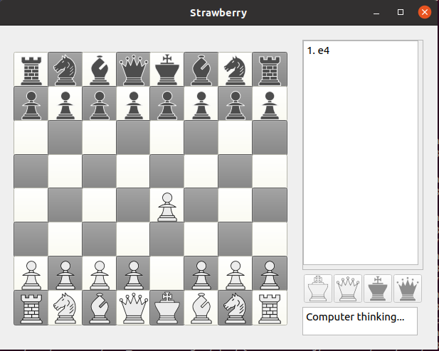

# strawberry

<div>
  <a href="https://github.com/fpringle/strawberry/actions/workflows/doc_coverage.yml">
    
  </a>
</div>

A Chess engine and GUI written in C++. Read the documentation [here](https://fpringle.github.io/strawberry).

### Submodules
strawberry has several components.

#### [strawberryCore](https://github.com/fpringle/strawberryCore)
- the core of the strawberry chess engine.

#### [strawberryGUI](https://github.com/fpringle/strawberryGUI)
- a Graphical User Interface (GUI) for the chess engine, written using Qt.

#### [strawberryUCI](https://github.com/fpringle/strawberryUCI)
- an interface for strawberry to communicate via the Universal Chess Interface (UCI) protocol.


## Build dependencies
- [Qt](https://www.qt.io)
  - all submodules need qmake to generate makefile
  - strawberryGUI needs Qt core and Qt gui

## Build instructions
Make sure to clone the submodules:
```bash
git submodule init
git submodule update
```

From the root directory:
```bash
qmake
make
```

To run the GUI:
```bash
./src/gui/build/unix/strawberryGUI
```

To play on the command-line:
```bash
./src/core/build/strawberryCLI
```

## Accreditation

Thanks to [Peter Wong](http://www.virtualpieces.net/) for the Chess piece icons.
